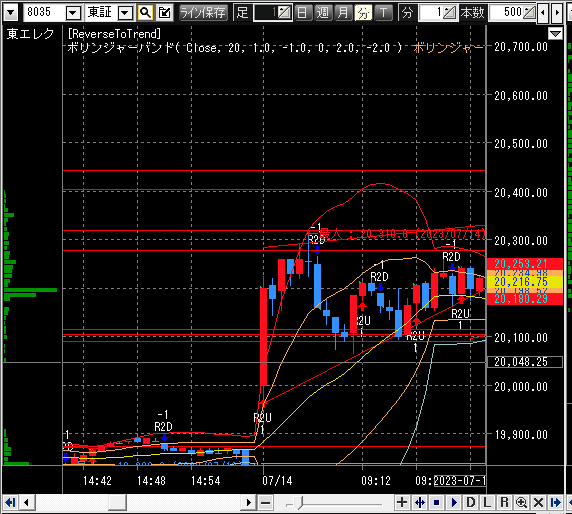
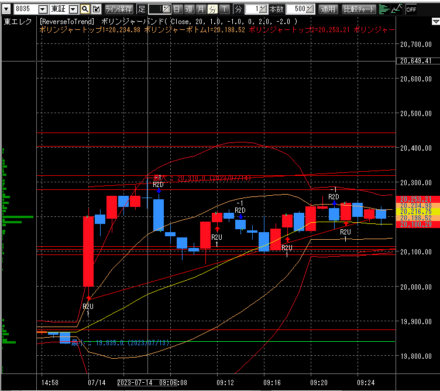
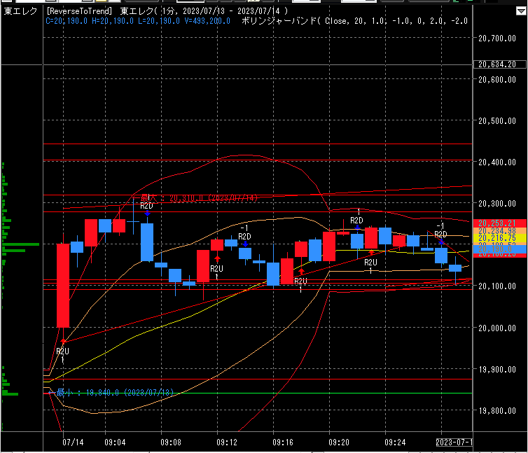
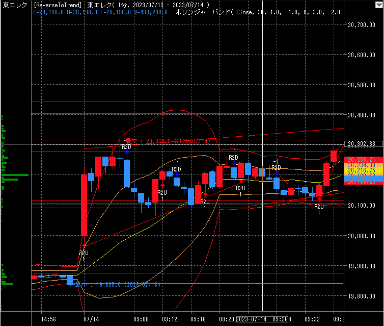
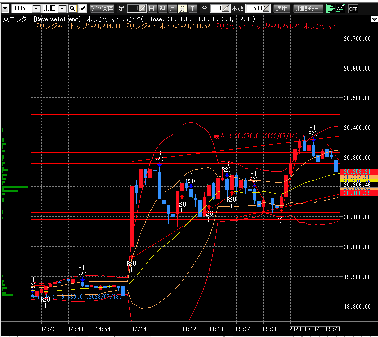
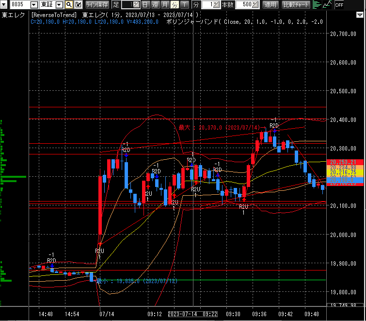
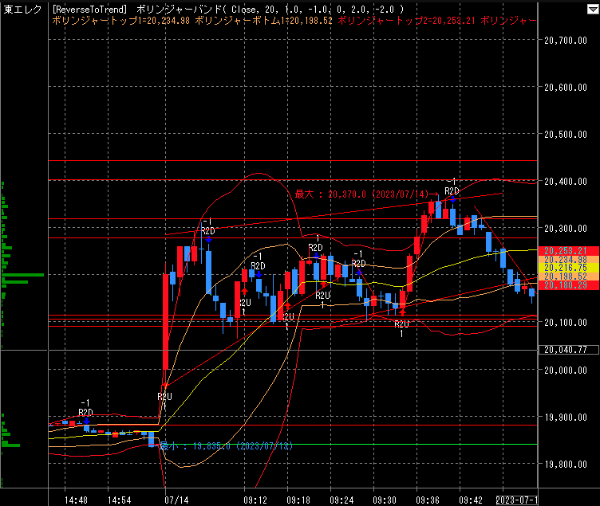
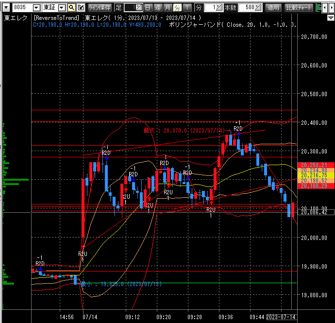
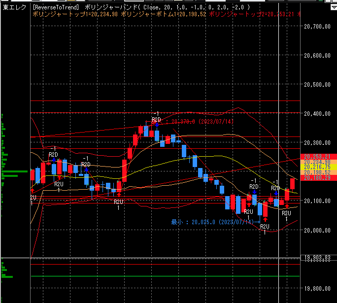

# 1. 9:24 東エレク 新規売り 20190円 100株

* 20280で２回跳ね返されている
* トレンドラインを割っている

# 2. 9:26 東エレク 新規売り 20210円 100株

* 20280で２回跳ね返されている
* トレンドラインを割っている
* ボリバン+1σに頭を抑えられている

# 3. 9:30 東エレク 返済買い 20140円 100株 +5000円

* ボリバン-1σタッチ
* 200株の半分を確定しておく

# 4. 9:35 東エレク 新規売り 20295円 100株

* 9:06の高値であり、反発しる可能性が高い
* 2.で損失を出している100株を決済するため

# 4. 9:45 東エレク 確定買い 20245円 200株 +1500円(+5000 -3500)

* ボリバン中央線タッチ
* 損失と利益を互いに打ち消すため

# 5. 9:50 東エレク 新規売り 20175円 100株

* サポートラインを割っている
* ボリバン-2σに足が滞在している
* 板の気配が売りが優勢（記憶）

# 6. 9:51 東エレク 確定買い 20150円 100株 +2500円

* 目先サポートラインが密集している価格帯で、急反発する可能性がある
* 板を見て早い目に手仕舞いできる価格を指した

# 7. 9:53 東エレク 新規買い 20085円 100株

* サポートラインが密集しており、反発する可能性が高い
* 板の気配が変わった
* 短期的な反発があった

# 8. 10:05 東エレク 確定売り 20150円 100株 +7500円

* ボリバン+1σタッチ

